# RISC-V RTL DESIGN
## INTRODUCTION
The RISC-V (pronounced "risk-five") processor is an open-source instruction set architecture (ISA) that has gained significant attention and popularity in recent years. It is designed to be simple, modular, and extensible, making it suitable for a wide range of applications, from embedded systems to high-performance computing.

RISC-V follows the principles of Reduced Instruction Set Computing (RISC), emphasizing simplicity and efficiency. Its clean and elegant design features a small number of core instructions that perform basic operations. Additional functionality can be added through optional extension modules, allowing for customization and scalability based on specific application requirements.

One of the key advantages of RISC-V is its open nature. The ISA specification is freely available, allowing anyone to study, implement, and modify it without any licensing restrictions. This openness has fostered a vibrant ecosystem of hardware and software developers, resulting in a wide variety of RISC-V implementations, tools, and libraries.

Modularity is another significant aspect of RISC-V. The ISA is divided into different base integer instruction sets (RV32I, RV64I, RV128I) with optional extensions for floating-point operations, multiplication and division, atomic operations, vector processing, and more. This modular approach enables system designers to tailor their RISC-V implementations to meet specific performance, power, and area requirements.

RISC-V processors have found applications in diverse fields, including embedded systems, Internet of Things (IoT) devices, smartphones, data centers, and supercomputers. The flexibility and scalability of the architecture, combined with the growing ecosystem, make it an attractive choice for both academic research and industrial development.

Thus, the RISC-V processor offers an open and flexible architecture that combines simplicity, modularity, and extensibility. Its broad range of applications, along with the active community support, has positioned RISC-V as a promising alternative to traditional closed-source ISAs, driving innovation and fostering collaboration in the processor design space. With its open nature and adaptability, RISC-V is poised to shape the future of computing and enable advancements in various domains.

## Output Waveforms
 

  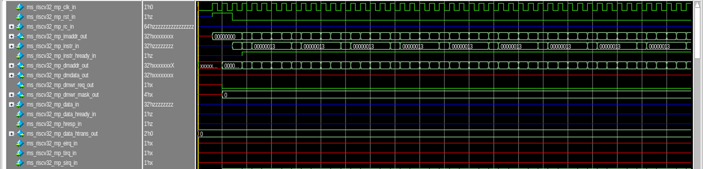 
  Top Module

 

  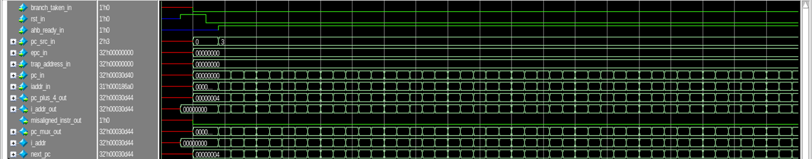 
  PC Mux

 

  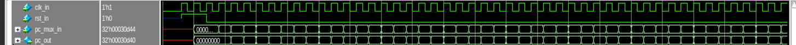 
  RegBlock 1

 

  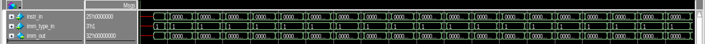 
  Immediate Generator

 

  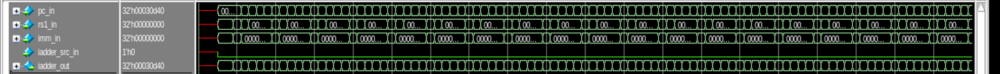 
  Immediate Adder

 

  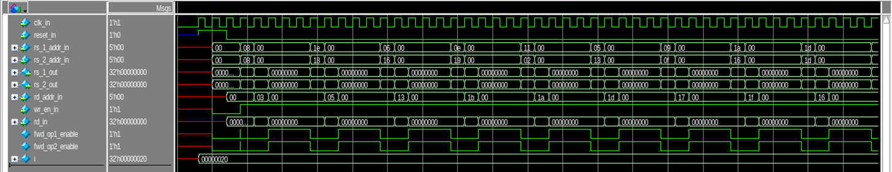 
  Integer File

 

  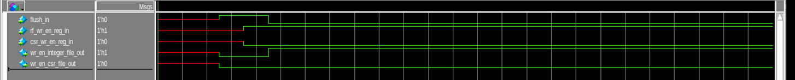 
  Wire Enable Generator

 

  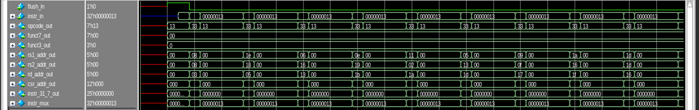 
  Instruction Mux

 

  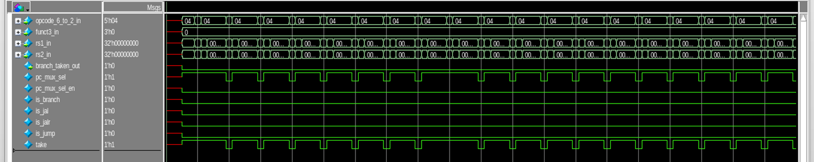 
  Branch Unit

 

  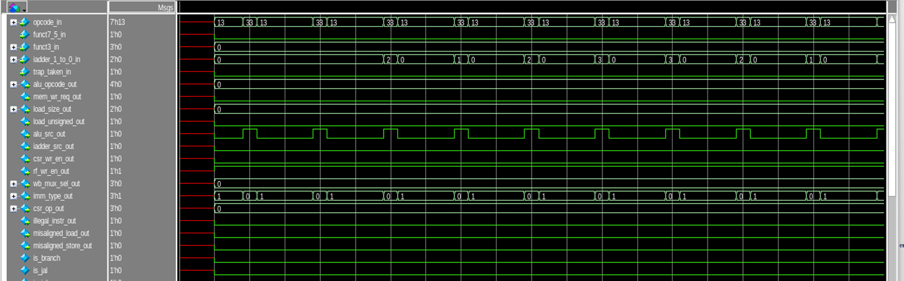 
  Decoder

 

  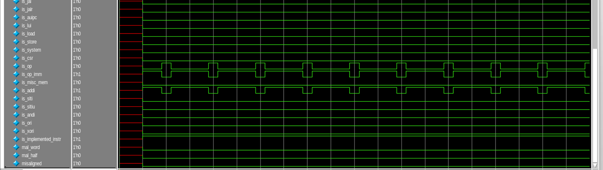 
  Decoder

 

  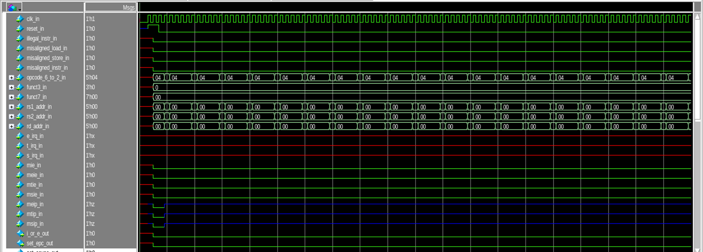 
  Machine Control

 

  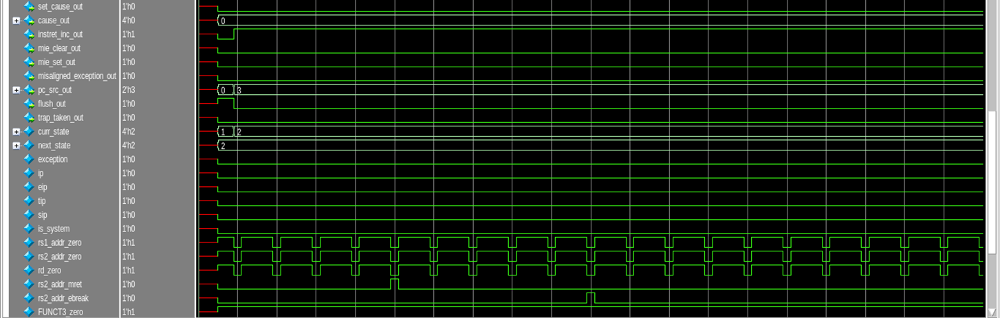 
  Machine Control

 

  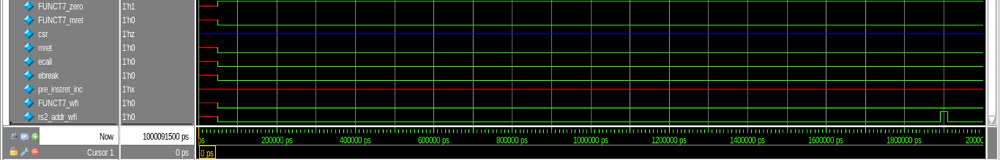 
  Machine Control

 

  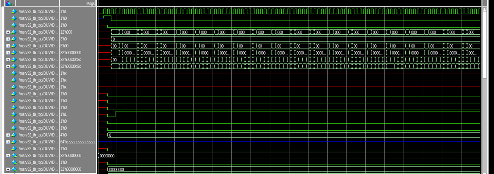 
  CSR File

 

  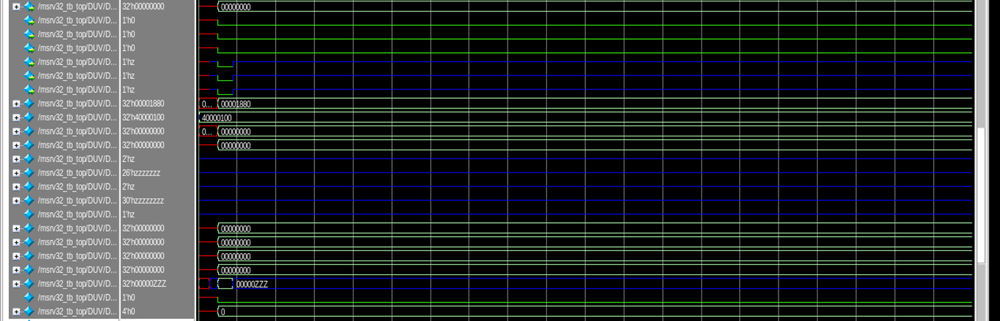 
  CSR File

 

  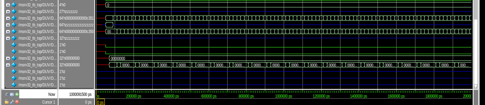 
  CSR File

 

  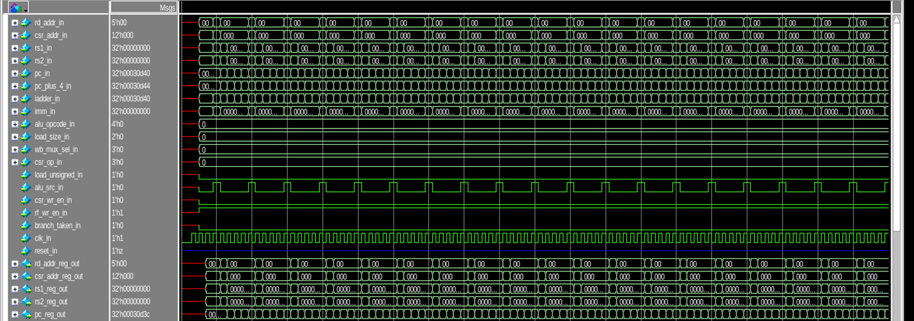 
  Reg Block 2

 

   
  Reg Block 2

 

  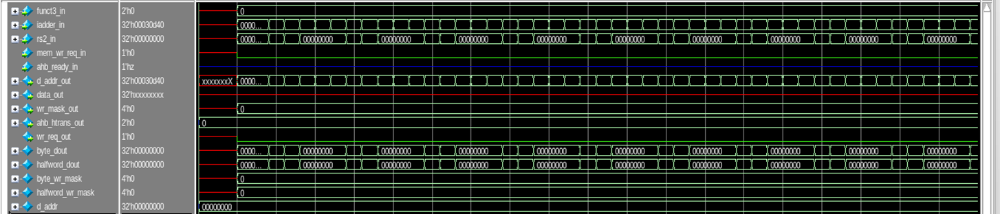 
  Store Unit

 

  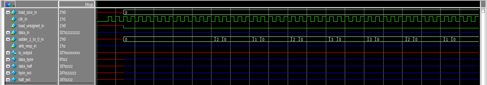 
  Load Unit

 

  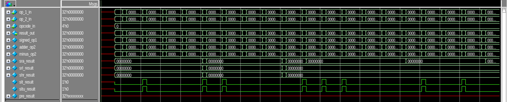 
  ALU

 

  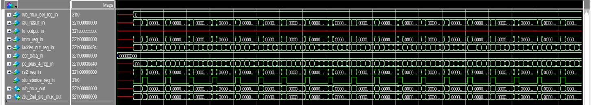 
  WB Mux Selection Unit

 

  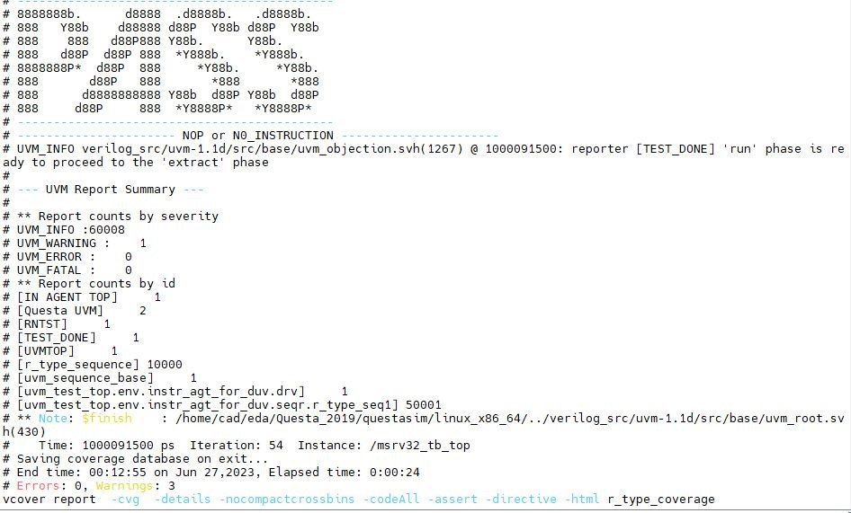 
  Result

